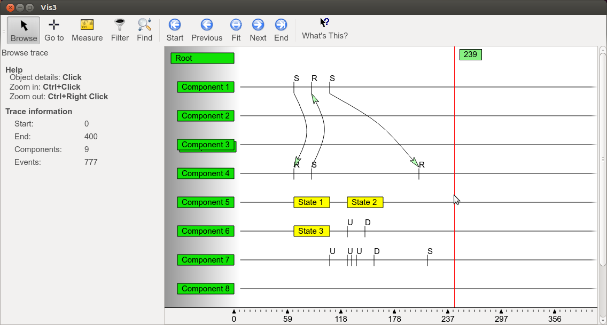

Vis 3
=====

This is a prototype implementation of a viewer for a trace of message passing
between components in a software/hardware system. This was created in 2006 
over a couple of weeks as a demonstration for a seminar talk on usability.

.

This implementation was further picked up and used in production use,
and a more advanced version using OTF trace format is now in development,
and hopefully will be available separately.
